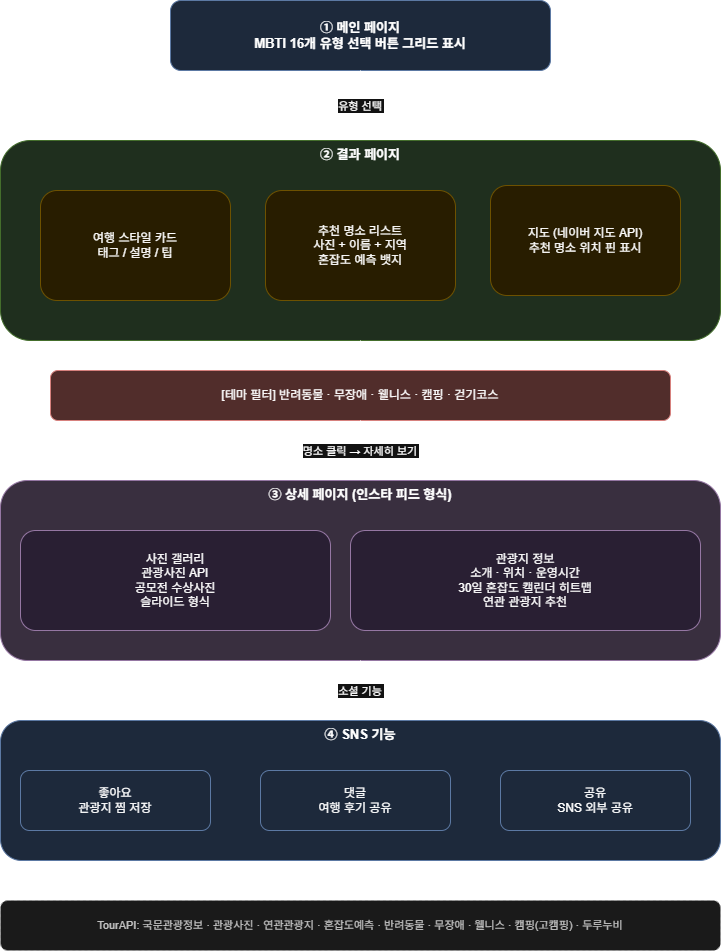

# IYK

2026 - 관광데이터 활용 공모전(웹, 앱)

 

# MBTI 여행 DNA — 한국관광공사 OpenAPI 기반 맞춤형 국내 여행 추천 서비스

> 2026 관광데이터 활용 공모전 - ① 웹·앱 개발 부문 출품작  
> Powered by 한국관광공사 TourAPI

 

## 서비스 개요

MBTI 16개 유형을 기반으로 개인 성향에 맞는 국내 여행지를 추천하는 웹 서비스입니다.  
한국관광공사 OpenAPI 데이터를 활용하여 관광지 정보, 사진, 혼잡도 예측, 테마 필터 기능을 제공하며,  
인스타그램 형식의 피드 UI와 SNS 기능(좋아요·댓글·공유)을 통해 여행 경험을 공유할 수 있습니다.

 

## 서비스 흐름도
 

 

## 페이지별 상세 설명

### ① 메인 페이지
- MBTI 16개 유형(INTJ, INTP, ... ESFP)을 버튼 그리드 형태로 표시
- 유형 선택 시 결과 페이지로 이동

### ② 결과 페이지
- **여행 스타일 카드**: 선택한 MBTI 유형의 여행 성향, 태그, 추천 팁 표시
- **추천 명소 리스트**: TourAPI 기반 관광지 목록 (사진, 이름, 지역, 혼잡도 뱃지)
- **지도**: 네이버 지도 API를 활용한 추천 명소 위치 핀 표시
- **테마 필터**: 반려동물 동반 / 무장애 / 웰니스 / 캠핑 / 걷기·자전거 코스

### ③ 상세 페이지
- 명소 클릭 또는 "자세히 보기" 버튼으로 진입
- **사진 갤러리**: 관광사진 API + 공모전 수상 사진, 슬라이드 형식
- **관광지 정보**: 소개·위치·운영시간 (국문 관광정보 API)
- **혼잡도 캘린더**: 향후 30일 방문자 집중률 예측 히트맵
- **연관 관광지**: "이런 곳도 가보세요" 자동 추천

### ④ SNS 기능
- **좋아요**: 관광지 찜 저장 및 인기 명소 집계
- **댓글**: 여행 후기 텍스트 작성 및 공유
- **공유**: 외부 SNS(카카오톡, 인스타그램 등) 공유

 

## 활용 API 목록

### 필수 (한국관광공사 OpenAPI)
| API명 | 활용 위치 |
|-------|---------|
| 국문 관광정보 서비스 | 전체 관광지 데이터 베이스 |
| 관광지별 연관 관광지 정보 | 상세 페이지 연관 추천 |
| 관광사진 정보 | 명소 리스트 이미지, 상세 갤러리 |
| 관광지 집중률 방문자 추이 예측 | 혼잡도 캘린더 히트맵 |

### 선택 — 테마 필터용
| API명 | 활용 위치 |
|-------|---------|
| 반려동물 동반여행 서비스 | 반려동물 필터 |
| 무장애 여행 정보 | 무장애 필터 |
| 웰니스관광정보 | 웰니스 필터 |
| 고캠핑 정보 조회서비스 | 캠핑 필터 |
| 두루누비 정보 서비스 | 걷기·자전거 코스 필터 |

### 지도
| API명 | 활용 위치 |
|-------|---------|
| 네이버 지도 API | 결과 페이지 지도, 위치 핀 표시 |

 

## 기술 스택

- **Frontend**: React (SPA)
- **Backend**: 미정
- **지도**: 네이버 지도 API
- **데이터**: 한국관광공사 OpenAPI (TourAPI)
- **배포**: 미정

 

## 링크

[한국관광콘텐츠랩 - 메인페이지](https://api.visitkorea.or.kr/#/cntSearchDetail?no=1)